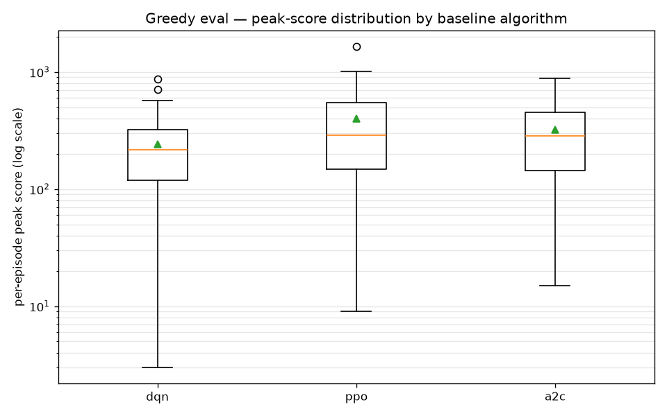
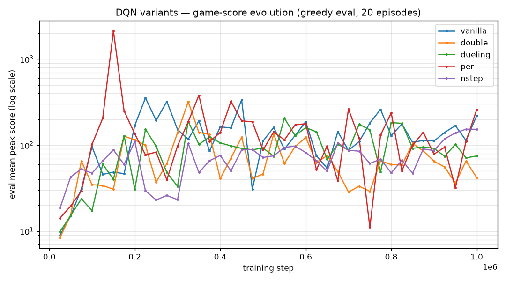
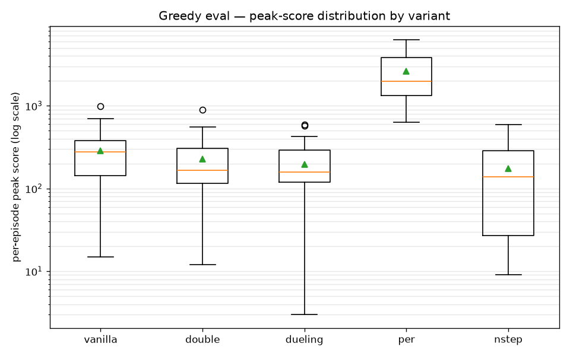
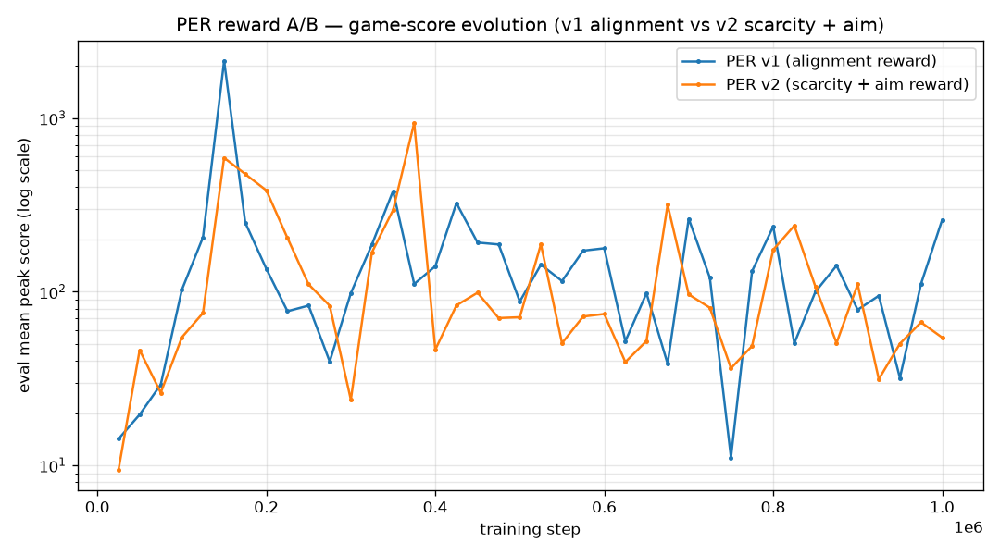

#  SI2 — Breakout: Reinforcement Learning Agents


<!-- =================================================================== -->
## How to Run

### Prerequisites

This project is managed with **[uv](https://docs.astral.sh/uv/)**. uv handles the
Python version (the project targets Python ≥ 3.13) and all dependencies — you do
**not** need to create a virtualenv or run `pip` yourself.

Install uv (if you don't have it):
```bash
curl -LsSf https://astral.sh/uv/install.sh | sh
```

### Setup

From the repository root, sync the environment from the lockfile:
```bash
uv sync
```
This creates `.venv/` and installs everything pinned in `uv.lock` (gymnasium,
stable-baselines3, sb3-contrib, torch, tensorboard, matplotlib, …).

### 1. Start the game server (and web viewer)

```bash
uv run python -m server.server          # serves on port 8765 by default
```
Then open the viewer in a browser:
```
http://localhost:8765/
```
The server hosts both the WebSocket game backend (`ws://localhost:8765/ws`) and
the HTML5 Canvas viewer in [server/viewer/](server/viewer/).

### 2. Connect an agent (in a second terminal)

All agents connect to the running server over WebSocket.

| Agent | Command | Notes |
|---|---|---|
| Dummy (random valid move) | `uv run python -m agents.dummy_agent` | sanity check |
| Manual (keyboard) | `uv run python -m agents.manual_agent` | `A`/`D` move, `Q` quit |
| Trained **SB3** agent | `uv run python -m agents.rl_agent --algo ppo` | loads `models/ppo_breakout/best_model.zip` by default; `--algo {dqn,ppo,a2c}`, `--model <path.zip>` |
| Trained **from-scratch DQN** | `uv run python -m agents.dqn_play_agent --model models/per_dqn/best_model.pt` | works for any variant checkpoint (`.pt`) |

### 3. Train

**Stable-Baselines3 baselines** (DQN / PPO / A2C):
```bash
uv run python -m agents.train --algo dqn --timesteps 1000000
```

**From-scratch DQN variants**. Use a
unique `--tag` so each run gets its own `models/<tag>/` and `runs/<tag>/`:
```bash
uv run python -m agents.dqn.vanilla_dqn  --timesteps 1000000 --tag vanilla_dqn
uv run python -m agents.dqn.double_dqn   --timesteps 1000000 --tag double_dqn
uv run python -m agents.dqn.dueling_dqn  --timesteps 1000000 --tag dueling_dqn
uv run python -m agents.dqn.per_dqn      --timesteps 1000000 --tag per_dqn
uv run python -m agents.dqn.nstep_dqn    --timesteps 1000000 --tag nstep_dqn
```

### 4. Evaluate

Greedy game-score evaluation over N episodes:
```bash
# SB3 model
uv run python -m agents.evaluate --algo ppo --model models/ppo_breakout/best_model.zip --episodes 30

# a single from-scratch variant
uv run python -m agents.dqn.per_dqn --eval-only --model models/per_dqn/best_model.pt --episodes 30

# all 5 variants side by side (identical seeds)
uv run python -m agents.dqn.compare --episodes 30
```

### 5. Monitor training (TensorBoard)

```bash
uv run tensorboard --logdir runs
```
Key scalars logged per run: `eval/mean_peak`, `game/peak_score`,
`game/boards_cleared`, `train/loss`, `train/epsilon` (and `train/beta` for PER).

### 6. Reproduce the report figures

```bash
uv run python -m agents.dqn.plots
```
Writes the figures in [figures/](figures/) (the boxplots run the greedy eval
in-process, so the variant checkpoints must exist).

<!-- =================================================================== -->
## Repository Layout

```
si2-breakout/
├── server/                     # Game backend + web viewer (base simulation)
│   ├── logic.py                #   Breakout physics: ball/paddle/brick, scoring, lives
│   ├── server.py               #   WebSocket server (ai-game-framework), port 8765
│   └── viewer/                 #   HTML5 Canvas frontend (index.html, script.js, styles.css)
│
├── agents/                     # All agent + RL code
│   ├── base_agent.py           #   WebSocket agent base class (deliberate() hook)
│   ├── dummy_agent.py          #   Random-valid-move agent
│   ├── manual_agent.py         #   Keyboard-controlled agent (terminal HUD)
│   ├── environment.py          #   Gymnasium wrapper: observation, action, reward(s)
│   ├── train.py                #   SB3 trainer (DQN/PPO/A2C) + frame-stacking + callbacks
│   ├── evaluate.py             #   SB3 greedy game-score evaluation
│   ├── rl_agent.py             #   Deploy an SB3 model against the live server
│   ├── dqn_play_agent.py       #   Deploy a from-scratch (.pt) model against the live server
│   └── dqn/                    #   From-scratch DQN variants (each a standalone trainer)
│       ├── vanilla_dqn.py
│       ├── double_dqn.py
│       ├── dueling_dqn.py
│       ├── per_dqn.py          #     Prioritized Experience Replay
│       ├── nstep_dqn.py        #     n-step returns
│       ├── compare.py          #     Side-by-side greedy comparison of all variants
│       └── plots.py            #     Build the report figures
│
├── models/                     # Saved checkpoints (one folder per --tag)
│   ├── <tag>/best_model.pt     #   from-scratch: best + final_model.pt
│   └── <run>_breakout/best_model.zip   # SB3: best + <run>_breakout_final.zip
├── runs/                       # TensorBoard logs (one folder per --tag)
├── figures/                    # Generated report figures (PNG)
├── tests/                      # Unit tests for the game logic
├── training_run.txt            # Captured training log of the 5-variant comparison
├── pyproject.toml / uv.lock    # Dependencies (uv-managed)
└── README.md                   # This report
```

**Checkpoints & configuration.** Every training run is namespaced by its `--tag`:
weights go to `models/<tag>/` (`best_model.{pt,zip}` selected on the greedy
eval score, plus a `final_model`) and TensorBoard logs to `runs/<tag>/`. Reward
and hyperparameters are set in [agents/environment.py](agents/environment.py)
(reward) and the trainer scripts (algorithm hyperparameters / CLI flags).

<!-- =================================================================== -->
## Gymnasium Environment

The base project ships only the raw game — a physics simulation
([server/logic.py](server/logic.py)) that exposes the current game state and
accepts paddle moves over WebSocket. To train RL agents on it, we wrap that
simulation in a **Gymnasium environment**, [`BreakoutEnv`](agents/environment.py).

The Gym wrapper is where the game becomes a formal **Markov Decision Process
(MDP)**. Instead of dealing with the simulation directly, the wrapper defines, at
a high level, everything an RL algorithm needs:

- the **observation** — how a game state is encoded for the agent,
- the **action space** — what the agent is allowed to do,
- the **transition** — what taking one step in the environment means, and
- the **reward function** — what the agent is optimized for.


**Observation space** — `Box(0, 1, shape=(19,))`. A 19-dimensional vector: the
ball position `(ball_x, ball_y)` and the paddle position `paddle_x` (all three
normalized to `[0, 1]` by the board size), followed by 16 binary flags, one per
brick, marking whether each brick is still active. The state deliberately does
**not** include the ball's velocity; the agent recovers direction and speed from
*frame-stacking*: the 4 most recent observations are concatenated downstream in
the training pipeline, so the policy effectively sees `4 × 19` inputs.

**Action space** — `Discrete(3)`: `WEST`, `STAY`, `EAST`. 

**Transition** — each `step()` applies the chosen move and advances the
simulation by one frame (`dt = 1/30 s`), matching the live server's 30 FPS tick,
so the dynamics the agent trains on are identical to those it faces at deployment.

**Reward** — configurable, defined in `calculate_reward`; covered in detail in
[Reward Design](#reward-design).

**Episode boundaries** — an episode *terminates* when the game ends (all 3 lives
lost) and is *truncated* at `max_steps` (3000 during training) to bound its
length.

<!-- =================================================================== -->
## Training & Evaluation Setup

All agents are trained for **1,000,000 environment steps**. The DQN family — the
SB3 DQN baseline and all five from-scratch variants — shares a single
configuration so the comparison stays fair; every value network is a simple MLP
with two hidden layers of 256 units (ReLU).

| Hyperparameter | Value |
|---|---|
| Total training steps | 1,000,000 |
| Network | MLP, 2 × 256 (ReLU) |
| Discount γ | 0.99 |
| Optimizer / learning rate | Adam, 2.5 × 10⁻⁴ |
| Replay buffer size | 100,000 |
| Batch size | 64 |
| Learning starts | 5,000 steps |
| Train frequency | every 4 steps |
| Target-network update | every 1,000 steps |
| Exploration ε | linear 1.0 → 0.05 over the first 20% of training |
| Frame stack | 4 |
| Evaluation frequency | every 25,000 steps |

(PPO and A2C are on-policy and use their own hyperparameters instead of a replay
buffer and ε-greedy; those are listed in
[Baseline Algorithms](#baseline-algorithms-stable-baselines3).)

**Training with periodic evaluation.** During training the agent explores with
ε-greedy and learns off-policy from the replay buffer. Every 25,000 steps training
pauses for a **greedy** evaluation (20 episodes; 5 for the SB3 baselines) and logs
the mean peak game score. Whenever that score improves, the current weights are
saved as `best_model`.

**Greedy-only evaluation.** The evaluation process is
**greedy / deterministic**: the agent always takes the highest-value action
(`argmax`), with no exploration.

<!-- =================================================================== -->
## Baseline Algorithms (Stable-Baselines3)

Three standard algorithms were trained as
**baselines**. Their purpose is to check how different algorithmic choices behave
on this task, comparing distinct families of RL methods and to give the
from-scratch work a reference to be measured against. For these we relied on
**[Stable-Baselines3](https://stable-baselines3.readthedocs.io/) (SB3)**, which
provides well-tested reference implementations of each algorithm. This lets us
abstract away the algorithm internals and focus on the environment, the reward,
and the evaluation, while still covering three different paradigms:

- **DQN** — off-policy, value-based (replay buffer + target network);
- **PPO** — on-policy policy gradient with a clipped objective;
- **A2C** — on-policy advantage actor-critic.

All three share the same `MlpPolicy` (two hidden layers of 256, ReLU), the same
4-frame-stacked observation, and the same environment and reward as the rest of
the project. DQN reuses the shared configuration from
[Training & Evaluation Setup](#training--evaluation-setup); the two on-policy
baselines use:

| Hyperparameter | PPO | A2C |
|---|---|---|
| Learning rate | 3 × 10⁻⁴ | 7 × 10⁻⁴ |
| Rollout length (`n_steps`) | 2048 | 5 |
| Batch size | 64 | — |
| GAE λ | 0.95 | — |
| Entropy coefficient | 0.0 | 0.01 |

**Results.** The boxplot below summarises 30 greedy episodes for each baseline
(peak game score per episode).



**RecurrentPPO (explored, dropped).** We also briefly looked into **RecurrentPPO**
(an LSTM-based policy from `sb3-contrib`), motivated by the idea that recurrence
could replace frame-stacking by carrying the ball's motion in the hidden state. In
practice it trained poorly and scored far below the feed-forward baselines, so it
was not pursued further.

<!-- =================================================================== -->
## From-scratch DQN Variants

Beyond the SB3 baselines, we implemented five DQN variants **from scratch** in
PyTorch ([agents/dqn/](agents/dqn/)). They all share the **same Q-network and the
same training loop** — only one targeted component changes between them — so the
comparison isolates the effect of each idea.

**The network** is a small MLP: the stacked observation (`4 × 19 = 76` inputs)
feeds two hidden layers of 256 units (ReLU) that output one Q-value per action.
Training uses ε-greedy exploration, a replay buffer, and a periodically-synced
target network (hyperparameters in
[Training & Evaluation Setup](#training--evaluation-setup)).

Each variant changes a single component:

- **Vanilla** — plain DQN with a 1-step TD target and a target network (baseline).
- **Double** — selects the next action with the online network but evaluates it
  with the target network, reducing Q-value over-estimation.
- **Dueling** — splits the head into a state-value `V(s)` and an advantage
  `A(s,a)` stream, recombined as `Q = V + (A − mean A)`.
- **PER (Prioritized Experience Replay)** — samples transitions in proportion to their TD-error (prioritized
  replay) instead of uniformly, with importance-sampling weights to correct the bias.
- **n-step** — bootstraps from `n`-step returns (`n = 3`) instead of a single step.



**Greedy evaluation (30 episodes, identical seeds):**

| variant | mean | median | max | std | boards | clear % |
|---|---|---|---|---|---|---|
| vanilla | 284.2 | 278 | 994 | 224.5 | 1.93 | 73% |
| double  | 227.6 | 166 | 888 | 192.7 | 1.53 | 53% |
| dueling | 196.9 | 157 | 589 | 152.2 | 1.33 | 60% |
| **per** | **2593.1** | **1983** | **6295** | 1606.8 | **17.63** | **100%** |
| nstep   | 175.6 | 139 | 592 | 166.4 | 1.17 | 43% |

_Reference baselines: SB3 DQN median 218 · SB3 PPO median 288._



**PER is the clear winner.** It reaches a median peak score of **1983** — roughly
**10× every other variant** (medians 139–278) and well above the SB3 baselines —
and clears ~17.6 boards per episode. It is also the **most consistent**: it cleared
at least one full board in **all 30 episodes** (100%, versus 43–73% for the
others), and even its worst episode (634) beats the others' *typical* scores.
Relative to its own level its spread is the smallest of the five (std/mean ≈ 0.6,
versus ≈ 0.8–0.95), so PER did not just raise the ceiling — it removed the frequent
near-zero episodes that drag the other variants down. In the boxplot this shows as
a distribution sitting far higher whose lower whisker never drops toward zero,
unlike the long low tails of the other variants.

<!-- =================================================================== -->
## Reward Design

We experimented with **two reward functions**, both defined in
[agents/environment.py](agents/environment.py) (`calculate_reward` and
`calculate_reward_v2`). They share the same backbone and differ only in one dense
shaping term.

**Shared part — the task reward.** Both encode the actual objective straight from
game events:

- **+1** for each brick broken,
- **+20** for clearing a full board,
- **−20** for losing a life.

This is the sparse signal that defines good play: break bricks, clear boards, stay
alive.

**Where they differ — the dense shaping.** On top of that backbone, each adds a
small per-step term to guide the paddle *between* those sparse events:

- **First reward — alignment.** A bonus on every descending step for keeping the
  paddle aligned with the ball's *current* horizontal position. In practice this
  turned out **too safe**: the agent is rewarded simply for sitting under the ball
  — a defensive "keep it in play" behaviour it can accumulate without ever pressing
  to attack and break bricks, so the dense bonus tends to overshadow the real
  scoring goal.
- **Second reward — potential-based shaping (PBRS).** Replaces the alignment bonus
  with a *potential-based* term over the ball's **predicted landing point**
  (`F = γ·Φ(s') − Φ(s)`, where `Φ` is the negative distance from the paddle to
  where the ball will land). Being potential-based, it telescopes to roughly zero
  over a trajectory, so it cannot be farmed and never overshadows the task reward —
  the intent being to stop paying the agent for passive tracking and let breaking
  bricks drive its behaviour instead.

**Result.** Because the reward is an environment-level change, we tested it on a
single algorithm — **PER**, the best model from the variant comparison. The second
reward **did not yield better results**: as the A/B figure below shows (labelled
`v1` for alignment and `v3` for PBRS), the two learning curves track each other
closely, and the simpler alignment reward still produced the strongest agent. We
therefore kept the first reward as the default.



## References

- [Gymnasium](https://gymnasium.farama.org/): the standard RL environment used to wrap the game as an MDP.
- [Stable-Baselines3](https://stable-baselines3.readthedocs.io/en/master/index.html): reference implementations of the DQN / PPO / A2C baselines.
- [RL-Adventure (higgsfield)](https://github.com/higgsfield/RL-Adventure): reference implementations of the DQN variants (Double, Dueling, Prioritized Experience Replay, n-step) that guided the implementation.